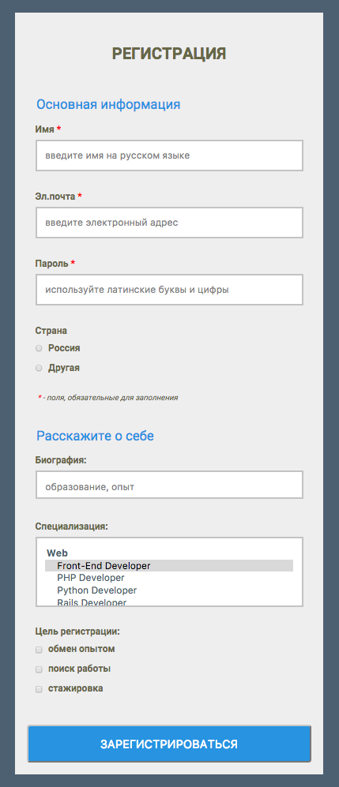
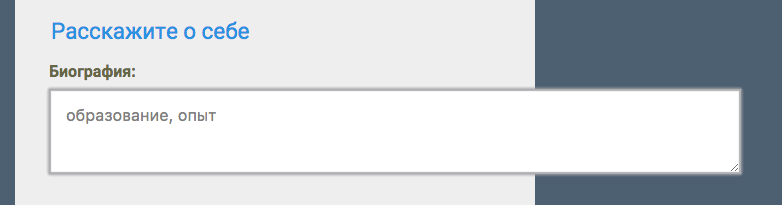

# Формы

> — Общая информация — 3-5 мин.
> — Введение — 8-10 мин.
> — Делаем форму — 30 мин.
> — HTML-разметка — 40-45 мин.

## Введение
_10 мин._

Формы нужны для того, чтобы собрать информацию от пользователя и отправить данные с сайта на сервер, который сможет эти данные обработать.

Сейчас сложно представить сайт без какой-либо формы. Без форм не существовали бы поисковые системы, социальные сети, невозможно было бы делать покупки в интернет-магазинах, бронировать отели, покупать билеты и многое другое.
То есть, если нужно, чтобы пользователь ввел и отправил какую-то информацию, потребуется использовать формы.

Виды взаимодействия пользователя и сайта с помощью форм могут быть разными:
-	регистрация и вход на сайтах;
-	ввод личной информации;
-	фильтрация контента (с помощью выпадающих списков, чек-боксов и так далее);
-	выполнение поиска;
-	загрузка файлов.

Чтобы приспособиться к этим потребностям, HTML предлагает интерактивные элементы управления формы:
-	поля ввода текста;
-	радио-кнопки (переключатели);
-	чек-боксы (флажки);
-	выпадающие списки;
-	виджеты для загрузки файлов;
-	кнопки отправки данных.

Давайте посмотрим примеры реальных форм.
> Продемонстрировать формы различного назначения на известных сайтах: яндекс, гугл, авито, фейсбук, букинг.

Формы, с которыми вы взаимодействуете много раз в день:

1. Поисковая строка Гугл и Яндекс (версия расширенного поиска):
    — https://www.google.ru/
    — https://www.yandex.ru/

2. Регистрация на сайте — на примере фб
    — https://www.facebook.com/

3. Поиск объявления на Авито
    — https://www.avito.ru/

4. Бронирование отеля:
    — https://www.booking.com/

---
**ВОПРОС СТУДЕНТАМ:**
Назовите общеизвестные сайты с формами и киньте ссылку в чат, посмотрим несколько ваших примеров. (Посмотреть первые 2 примера и продолжить)
---

На этом занятии мы обсудим, как использовать HTML для разметки формы и как стилизовать формы с помощью CSS.

Учиться это делать мы будем на практическом примере. Параллельно мы разберем наиболее важные теоретические моменты.

Сегодня мы с вами сделаем форму регистрации для конференции IT-специалистов.

Вот как будет выглядеть наш результат:


[Ссылка](http://university.netology.ru/u/makhonina/Form/example2.html)

## Делаем форму
_(пошагово в кодпэне) 40 мин._

При регистрации на конференцию нам потребуются от пользователя следующие данные:
- Имя для бэджика;
- Email, на который мы пришлем информацию;
- Пароль для входа в личный кабинет;
- Дополнительная информация, о которой мы поговорим чуть позже.

### HTML-разметка

Основу любой формы составляет парный тег `<form>`. Данный элемент определяет, где на странице появится форма.

Кроме того, элемент `<form>` оборачивает все элементы, включенные в форму, подобно элементу `<div>`. Он позволяет объединить элементы формы в единую структуру и сообщает браузеру, что эта структура должна восприниматься как единое целое.

<!-- Под сомнением -->
Также, используя тег `<form>`, мы можем сообщать браузеру, куда конкретно и каким образом нужно отправить данные, которые введены в элементах формы, чтобы они были обработаны специальной программой.

Для этого используются специальные атрибуты:
- `action` — этот атрибут является обязательным. Создавать форму без него особого смысла не имеет. С его помощью указывается путь к программе, которая будет обрабатывать данные, введенные в форму (url обработчика формы на сервере).
- `method` — этим атрибутом мы указываем метод, с помощью которого данные будут переданы к программе обработчику (метод HTTP, который должны использовать браузеры для отправки данных формы).
Здесь возможны два варианта — `GET` и `POST`.

Метод `GET` передает данные на сервер через адресную строку браузера. Но если вместе с формой предполагается отправка какого-либо файла, этот метод не подойдет.

Метод `POST` применяется для пересылки данных больших объемов, а также конфиденциальной информации и паролей. Данные, отправляемые с помощью этого метода, не видны в заголовке URL, так как они содержатся в теле сообщения.
`method` — необязательный атрибут. Если не указывать атрибут `method`, то по умолчанию будет использован метод `GET`.

Остальные атрибуты встречаются намного реже, для решения специфических задач, при необходимости вы можете изучить их самостоятельно по этой ссылке https://webref.ru/html/form
<!-- END -->

Давайте добавим эти два атрибута к нашей форме и добавим заголовок.
```html
<form action="example2.html" method="post">
  <h2>Регистрация</h2>
</form>
```

Теперь нам нужно создать поля для ввода информации.

Есть 2 основных элемента для сбора данных на основе текста — поля для ввода небольшого количества текста (пароль, имя, email) и поля для ввода многострочного текста (развернутый комментарий, отрывок текста).

В нашем примере для регистрации пользователь сначала должен ввести свое имя, email и пароль.

Для этого подойдут поля ввода небольшого количества текста разных типов. Такие поля создаются с помощью элемента `<input>`.

Элемент `<input>` является одиночным тегом, то есть в него ничего нельзя завернуть.

У элемента `<input>` есть обязательный атрибут `type`, который сообщает браузеру, что за данные будут вводиться в это поле.

Наряду с атрибутом `type`, элементу `<input>` задается атрибут `name`. Значение атрибута `name` отправляется на сервер вместе с введенными данными и помогает сопоставить что и в какое поле ввел пользователь.

Для создания полей ввода имени, email'a и пароля нам потребуются значения артибута `type`:
- `text` — поле ввода одной строки с именем.
```html
<input type="text" name="user_name">
```
- `email` — поле ввода адреса электронной почты.
```html
<input type="email" name="user_email">
```
- `password` — поле ввода пароля, в которой вводимые символы отображаются звездочками.
```html
<input type="password" name="user_password">
```

Также есть много других типов текстовых полей для различных целей: `date`, `number`, `tel`, `url` и другие. Хотя эти поля очень похожи, их тип обеспечивает специфическую семантику введенному тексту, определяя, какую информацию поле должно содержать.

Эти значения добавлены, чтобы обеспечить чёткое смысловое значение для полей ввода, а также предоставить лучшее управление пользователям. Например, поле для пароля показывает точки вместо символов, а поле поиска имеет элемент для быстрой очистки.

Ещё одним элементом для сбора текстовых данных является поле ввода многострочного текста `<textarea>`. Оно отличается от элемента `<input>` тем, что в него можно ввести большой текст в несколько строк.

Тег `<textarea>` ялвляется парным, внутрь него можно что-нибудь завернуть.

`<textarea>` принимает только один тип значения, поэтому атрибут `type` здесь не нужен, но атрибут `name` по-прежнему используется.
```html
<textarea name="user_bio"></textarea>
```

В браузерах в правом нижнем углу текстового поля отображается небольшой уголок, с помощью которого, если нажать клавишу мыши и потянуть за уголок, можно изменить размеры поля. Для того, чтобы это поле выглядело всегда красиво и не возникало вот такой ситуации

_(растянуть поле за пределы формы)_

у вас есть 2 варианта:
- отключить эту возможность, задав для `textarea` свойство `resize` со значением `none`;
- ограничить ширину, чтобы поле не «уползало» за пределы формы.

Хочу обратить ваше внимание на один важный момент, касающийся полей. В браузерах есть по умолчанию стили для полей ввода — обводка, которая появляется, когда курсор установлен в поле ввода и пользователь может набирать текст. Эти стили не стоит  убирать даже если заказчик/дизайнер настаивают.

Есть пользователи, у которых нет мышки, они передвигаются по контенту страницы при помощи TAB. Дайте им возможность видеть на каком элементе они сейчас находятся.

У `input` и `textarea` есть еще ряд атрибутов, наиболее полезные в нашем случае.

Атрибут `placeholder` выводит подсказывающий текст внутри текстового поля, который исчезает при наборе текста.
Это удобно когда нужно оставить пользователю подсказку по заполнению конкретного поля.

Атрибут `required` делает текстовое поле обязательным для заполнения. Если в обязательном поле при попытке отправить данные не будет текста, браузер выведет сообщение, а форма отправлена не будет.

Допишем эти атрибуты:
```html
<input type="text" name="user_name" placeholder="введите имя на русском" required>
<input type="email" name="user_email" placeholder="введите электронный адрес" required>
<input type="password" name="user_password" placeholder="используйте латинские буквы и цифры" required>
<textarea name="user_bio" placeholder="образование, опыт"></textarea>
```

---
**ВОПРОС СТУДЕНТАМ:**
назовите отличия `textarea` от `input` (парный тег, можно ввести большие отрывки текста, принимает только один тип значения, поэтому атрибут `type` не нужен, внешне — есть тянущийся уголок)
---

#### Организация элементов формы

Итак, мы с вами создали поля для ввода информации. Для простой формы этого будет вполне достаточно.

Но если в вашей форме большое количество полей, то стоит сгруппировать их в блоки и задать подписи для каждого из них.

Для этого используются элементы `<label>`, `<fieldset>` и `<legend>`.

Подписи к полям формы создаются с помощью парного тега `<label>`.

Существует два способа группировки надписи и поля.
1. При помощи атрибута `for`, включенного в `<label>`. Тогда его значение должно быть таким же, как значение атрибута `id` у элемента, с которым связан `<label>`. Связь между полем и надписью нужна, чтобы при клике на надпись фокус перемещался в нужное поле формы.
```html
<label for="name">Имя<span>*</span></label>
<input type="text" name="user_name" id="name" placeholder="введите имя на русском языке" required>

<label for="mail">Эл.почта<span>*</span></label>
<input type="email" name="user_email" id="mail" placeholder="введите электронный адрес" required>

<label for="password">Пароль<span>*</span></label>
<input type="password" name="user_password" id="password" placeholder="используйте латинские буквы и цифры" required>

<label for="bio">Биография:</label>
<textarea name="user_bio" id="bio" placeholder="образование, опыт"></textarea>
```
Нажимая на надпись к полю мы сразу попадаем в нужное нам поле для заполнения _(показать)_.

2. Без атрибута `for`. В этом случае поле находится внутри элемента `<label>`.
Мы этот вариант рассмотрим чуть позже.

`<fieldset>` группирует поля формы в организованные блоки, разделяя таким образом форму на логические фрагменты. (подобно `<section>`).

`<fieldset>` по умолчанию также включают в себя границы контура, которые могут быть изменены с помощью CSS.

Каждому такому разделу можно присвоить название с помощью элемента `<legend>`, который идет в разметке сразу за тегом `<fieldset>`. Название раздела появится в левом верхнем углу рамки `<fieldset>`. Положение и внешний вид также можно менять при помощи CSS.

Сделаем в нашей форме 2 раздела и добавим им названия.
```html
<form action="example2.html" method="post">
  <h2>Регистрация</h2>
  <fieldset>
    <legend>Основная информация</legend>
    <label for="name">Имя<span>*</span></label>
    <input type="text" name="user_name" id="name" placeholder="введите имя на русском языке" required>

    <label for="mail">Эл.почта<span>*</span></label>
    <input type="email" name="user_email" id="mail" placeholder="введите электронный адрес" required>

    <label for="password">Пароль<span>*</span></label>
    <input type="password" name="user_password" id="password" placeholder="используйте латинские буквы и цифры" required>
  </fieldset>

  <fieldset>
    <legend>Расскажите о себе</legend>
    <label for="bio">Биография:</label>
    <textarea name="user_bio" id="bio" placeholder="образование, опыт"></textarea>
  </fieldset>
</form>
```

Обязательные для заполнения поля принято еще дополнительно отмечать, что мы и сделали. Обычно их отмечают красной звездочкой рядом с подписью.

Желательно также написать в самой форме, в идеале в начале формы, что означает эта звездочка.
```html
<div><span>*</span> — поля,обязательные для заполнения</div>
```

#### Поля выбора

Помимо текстовых полей, есть несколько элементов формы, которые позволяют пользователям выбирать данные.

Радио-кнопки (радио-баттоны) или переключатели — это простой способ, позволяющий пользователям выбрать один единственный вариант из предложенного небольшого списка вариантов.

Чтобы создать радио-кнопку, используется элемент `<input>` со значением `radio` у атрибута `type`.

Переключатели одной смысловой группы должны иметь одинаковое значение атрибута `name`, чтобы они в группе были связаны друг с другом и нельзя было выбрать больше одного варианта.

Также с помощью атрибута `value` мы должны определить входное значение для каждого элемента `<input>`.

Если нам нужно предварительно выбрать радио-кнопку, мы можем добавить атрибут `checked`.
```html
<input type="radio" name="country" value="russia" checked>Россия
<input type="radio" name="country" value="other">Другая
```

Следующий тип элемента выбора — чек-боксы или флажки. Они похожи на радио-кнопки, используют те же атрибуты и шаблоны, за исключением значения атрибута `type`.

Но в отличие от радио-кнопок чек-боксы позволяют пользователям выбрать несколько значений одновременно.
```html
<input type="checkbox" name="user_purpose" value="purpose_experience">обмен опытом
<input type="checkbox" name="user_purpose" value="purpose_job">поиск работы
<input type="checkbox" name="user_purpose" value="purpose_probation">стажировка
```
Добавим подписи, но теперь в другом варианте
без `for`. В этом случае поле находится внутри элемента `<label>`:
```html
<label>
  <input type="radio" name="country" value="russia">Россия
</label>
<label>
 <input type="radio" name="country" value="other">Другая
</label>

<label>
  <input type="checkbox" name="user_purpose" value="purpose_experience">обмен опытом
</label>
<label>
  <input type="checkbox" name="user_purpose" value="purpose_job">поиск работы
</label>
<label>
  <input type="checkbox" name="user_purpose" value="purpose_probation">стажировка
</label>
```

Еще один вариант для выбора одного из предложенных вариантов — выпадающие списки.

Радио-кнопки и чек-боксы используют для небольшого количества вариантов. Что же делать, если вариантов для выбора много?

Длинный столбец переключателей рядом со списком разных вариантов будет выглядеть не очень красиво, а также будет сложен для понимания.

В таком случае лучшим вариантом будет выпадающий список.

Для создания выпадающего списка применяются элементы `<select>` и `<option>`.

`<select>` оборачивает все пункты меню, `<option>` оборачивает текст (который виден пользователям) каждого отдельного пункта в списке.

Атрибут `name` располагается в элементе `<select>`, а атрибут `value` располагается в элементах `<option>`, вложенных в элемент `<select>`. Так мы связываем атрибут `value` в каждом элементе `<option>` с атрибутом name элемента `<select>`.
```html
<label for="job">Специализация:</label>
<select name="user_job" id="job" multiple>
  <optgroup label="Web">
    <option value="frontend_developer" selected>Front-End Developer</option>
    <option value="php_developor">PHP Developer</option>
    <option value="python_developer">Python Developer</option>
    <option value="rails_developer"> Rails Developer</option>
    <option value="web_designer">Web Designer</option>
    <option value="WordPress_developer">WordPress Developer</option>
  </optgroup>
  <optgroup label="Mobile">
    <option value="Android_developer">Androild Developer</option>
    <option value="iOS_developer">iOS Developer</option>
    <option value="mobile_designer">Mobile Designer</option>
  </optgroup>
</select>
```

Для группировки в выпадающем списке связанных логически вариантов `<option>` используется тег `<optgroup>`.

Вместо атрибуту `checked`, который мы используем для предварительного выбора нужного пункта у радио-кнопок и чек-боксов, для выпадающего меню можно использовать атрибут `selected`.
```html
<select name="user_job" >
	<optgroup label="Web">
  	<option value="frontend_developer" selected>Front-End Developer</option>
  	<option value="php_developor">PHP Developer</option>
  	<option value="python_developer">Python Developer</option>
  	<option value="rails_developer"> Rails Developer</option>
  	<option value="web_designer">Web Designer</option>
  	<option value="WordPress_developer">WordPress Developer</option>
	</optgroup>
  	<optgroup label="Mobile">
  	<option value="Android_developer">Androild Developer</option>
  	<option value="iOS_developer">iOS Developer</option>
  	<option value="mobile_designer">Mobile Designer</option>
	</optgroup>
</select>
```

Еcли вам нужно, чтобы пользователь выбрал несколько вариантов из выпадающего списка одновременно, добавьте атрибут `multiple` к элементу `<select>`. Для выбора нескольких вариантов необходимо удерживать клавишу Shift во время клика, об этом нужно информировать пользователя.

---
**ВОПРОС СТУДЕНТАМ:**
напишите, какие атрибуты `input` вы запомнили и коротко поясните для чего они? `type` — тип элемента, `name` — чтобы обработчик формы мог его идентифицировать для правильной обработки на сервере, `placeholder` — подсказывающее поле, `required` — обязательное для заполнения поле, `value` — значение элемента, `checked` — предварительно активирует радио-кнопку или чек-бокс.
---

#### Кнопки для отправки
После того, как пользователь ввел необходимую информацию, нам понадобится элемент для отправки этой информации. Для этого используются 2 варианта элементов: `input` или `button`.

Оба эти варианты выполняют одну и ту же функцию, но между ними есть отличия.

Кнопка для отправки в виде элемента `<input>` создаётся со значением `submit` у атрибута `type`. А в атрибуте `value` мы указываем текст, который отображается внутри кнопки.
```html
<input type="submit" name="submit" value="Отправить">
```

Вы видите, что в нашей форме появилась кнопка «отправить». Если мы ее нажимаем, то появляется подсказка «Заполните это поле», так как мы не заполнили обязательные поля.

Но в таком варианте есть один минус. Как вы помните, `input` не может оборачивать какой-либо контент.

Поэтому,если нам нужно больше контроля над структурой и дизайном кнопки и мы хотим обернуть другие элементы — тогда необходимо использовать элемент `<button>`.

При использовании `<button>` пользователь будет видеть текст, написанный между открывающим и закрывающим тегами.
```html
<button type="submit">Зарегистрироваться</button>
```

При попытке отправить форму происходит то же самое.

Структура нашей формы готова.
```html
<form action="example2.html" method="post">
  <h2>Регистрация</h2>
  <div><span>*</span> — поля,обязательные для заполнения</div>
  <fieldset>
    <legend>Основная информация</legend>
    <label for="name">Имя<span>*</span></label>
    <input type="text" name="user_name" id="name" placeholder="введите имя на русском языке" required>

    <label for="mail">Эл.почта<span>*</span></label>
    <input type="email" name="user_email" id="mail" placeholder="введите электронный адрес" required>

    <label for="password">Пароль<span>*</span></label>
    <input type="password" name="user_password" id="password" placeholder="используйте латинские буквы и цифры" required>

    <label>Страна</label>
    <label>
      <input type="radio" name="country" value="russia">Россия
    </label>
    <label>
      <input type="radio" name="country" value="other">Другая
    </label>
  </fieldset>

  <fieldset>
    <legend>Расскажите о себе</legend>
    <label for="bio">Биография:</label>
    <textarea name="user_bio" id="bio" placeholder="образование, опыт"></textarea>

    <label for="job">Специализация:</label>
    <select name="user_job" id="job" multiple>
      <optgroup label="Web">
        <option value="frontend_developer" selected>Front-End Developer</option>
        <option value="php_developor">PHP Developer</option>
        <option value="python_developer">Python Developer</option>
        <option value="rails_developer"> Rails Developer</option>
        <option value="web_designer">Web Designer</option>
        <option value="WordPress_developer">WordPress Developer</option>
      </optgroup>
      <optgroup label="Mobile">
        <option value="Android_developer">Androild Developer</option>
        <option value="iOS_developer">iOS Developer</option>
        <option value="mobile_designer">Mobile Designer</option>
      </optgroup>
    </select>

    <label>Цель регистрации:</label>
      <label>
        <input type="checkbox" name="user_purpose" value="purpose_experience">обмен опытом
      </label>
      <label>
        <input type="checkbox" name="user_purpose" value="purpose_job">поиск работы
      </label>
      <label>
        <input type="checkbox" name="user_purpose" value="purpose_probation">стажировка
      </label>
  </fieldset>

  <button type="submit">Зарегистрироваться</button>
</form>
```

Теперь сделаем ее более красивой.

### Cтилизация формы
Сначала подключим шрифт и подкрасим фон, чтобы элементы формы было лучше видно.
```css
body {
  font-family: Roboto, sans-serif;
  background-color: #445566;
}
```

Теперь изменим размер и выделим саму форму.
```css
form {
  max-width: 480px;
  margin: 0 auto 10px;
  padding: 0 20px 10px;
  background-color: #ebebeb;
}
```

Декорируем заголовок
```css
h2 {
  padding: 50px 20px 30px;
  font-size: 1.7em;
  text-align: center;
  text-transform: uppercase;
  color: #5c5c3d;
}
```

Добавим стили к полям ввода
```css
input,
textarea,
select {
  width: 100%;
  height: auto;
  margin: 0 auto 30px;
  padding: 15px;
  box-sizing: border-box;
  font-size: 16px;
  color: #445566;
  background-color: #ffffff;
  border: 2px solid #bbbbbb;
}
```

Чек-боксы и радио-кнопки будут лучше смотреться, если мы расположим их друг под другом, а не в одну строку.

Для этого добавим следующие свойства к подписям:
```css
label {
  display: block;
  margin-bottom: 8px;
  font-weight: 700;
  color: #5c5c3d;
}
```
и немного изменим отступы у переключателей и флажков и переопределим ширину:
```css
input[type="radio"],
input[type="checkbox"] {
 width: auto;
 margin: 5px 10px 5px 0;
}
```

Стилизуем кнопку
```css
button {
  width: 100%;
  margin-bottom: 10px;
  padding: 19px 39px 18px 39px;
  font-size: 1.2em;
  text-align: center;
  text-transform: uppercase;
  color: #ffffff;
  background-color: #2288dd;
  border-radius: 5px;
}
```

Уберем границы у секций
```css
fieldset {
  margin-bottom: 30px;
  border: none;
}
```

Стилизуем подписи к секциям
```css
legend {
  margin-bottom: 10px;
  font-size: 1.4em;
  color: #2288dd;
}
```

Сделаем звездочку в обязательных для заполнения полях красной и немного отодвинем ее
```css
span {
  padding-left: 5px;
  color: #ff0000;
}
```

Стилизуем сообщение об обязателых полях для заполнения.
```css
div {
  padding-top: 20px;
  font-style: italic;
  font-size: 0.8em;
  color: #5c5c3d;
}
```

Уберем тянущийся уголок в правом нижнем углу многострочного поля ввода, про который мы говорили. Для этого нужно задать для `textarea` свойство `resize` со значением `none`.
```css
textarea{
  height: 48px;
  resize: none;
}
```

### Заключительная часть.

Теперь все стало на свои места. Проверим работу полного варианта формы (заполнить поля, нажать отправить).Все работает.

---
**ВОПРОС СТУДЕНТАМ:**
_спрятав код, указать на элементы созданной формы и попросить назвать теги, которые формируют этот элемент._
Например, «Основная информация» — `legend` и так далее
---

Также хочу поделиться с вами ссылкой на один интересный сервис, который поможет вам сделать «живую» форму для отправки сообщений с сайта на ваш адрес электронной почты. Просто вставьте код формы с сайта, измените адрес электронной почты и получайте сообщения без PHP, Javascript или регистрации.
https://formspree.io/

Поздравляю! Теперь вы умеете создавать формы.

Если вы хотите научиться не только создавать формы, но и обрабатывать данные форм, мы ждем вас на нашем факультете программирования (показать и скинуть в чат ссылку).
https://netology.ru/development/programs
